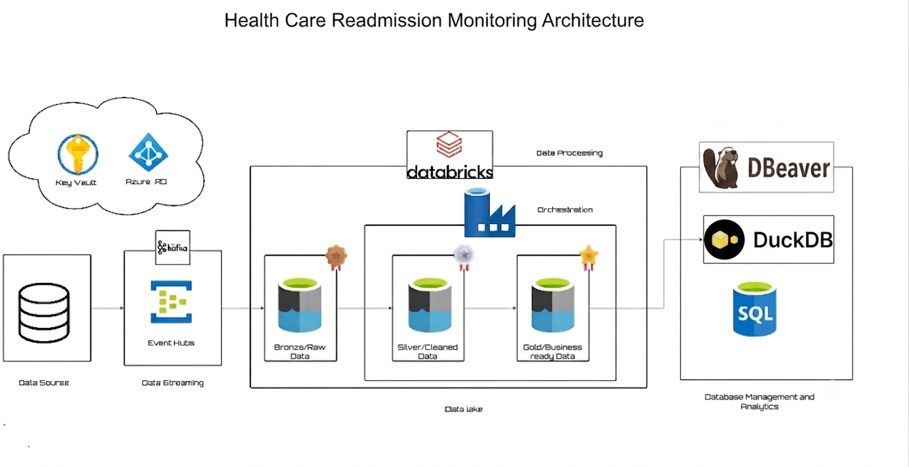

# 🏥 Healthcare Patient Risk Data Platform


---

# 📑 Table of Contents

- [Project Overview](#-project-overview)
- [Business Requirements](#-business-requirements)
- [Objectives](#-objectives)
- [Technology Stack](#-technology-stack)
- [Solution Architecture](#-solution-architecture)
- [Project Structure](#-project-structure)
- [Pipeline Implementation](#-pipeline-implementation)
- [Data Model](#-data-model)
- [SQL Validation](#-sql-validation)
- [Project Outcomes](#-project-outcomes)
- [License](#-license)

---

# 📌 Project Overview

This project demonstrates an end-to-end Azure Healthcare Data Engineering Platform built to process **HL7 FHIR clinical data** for patient readmission analytics.

The platform ingests streaming healthcare events through **Apache Kafka and Azure Event Hubs**, orchestrates processing with **Azure Data Factory**, transforms data using **Azure Databricks (PySpark)** following the **Medallion Architecture**, stores curated Delta tables in **Azure Data Lake Storage Gen2**, and validates analytical datasets using **DBeaver SQL**.

The final Gold layer provides analytics-ready datasets that support patient readmission analysis and healthcare reporting.

---

# 🏥 Business Requirements

Healthcare organizations generate millions of clinical records every day. These datasets are commonly stored as HL7 FHIR resources across multiple clinical domains including Patients, Encounters, Conditions, Medications, Procedures, and Observations.

The challenge is transforming fragmented clinical data into trusted analytical datasets that support patient outcome analysis, operational reporting, and readmission monitoring.

This project addresses that challenge by building a scalable cloud-native data platform capable of ingesting, processing, validating, and curating healthcare data for downstream analytics.

---

# 🎯 Objectives

- Stream HL7 FHIR resources using Apache Kafka.
- Ingest healthcare events through Azure Event Hubs.
- Build an automated orchestration pipeline using Azure Data Factory.
- Process healthcare data using Azure Databricks.
- Implement Bronze, Silver, and Gold Delta Lake architecture.
- Create analytics-ready patient and encounter datasets.
- Validate Gold tables using SQL and DBeaver.
- Apply healthcare data quality checks throughout the pipeline.

---

# 🛠 Technology Stack

| Category | Technologies |
|-----------|--------------|
| Cloud | Azure |
| Streaming | Apache Kafka, Azure Event Hubs |
| Storage | Azure Data Lake Storage Gen2 |
| Processing | Azure Databricks, PySpark |
| Orchestration | Azure Data Factory |
| Data Format | HL7 FHIR |
| Storage Format | Delta Lake |
| SQL Validation | DBeaver |
| Version Control | Git & GitHub |

---

# 📐 Solution Architecture



```
Kafka Producer
      │
      ▼
Azure Event Hubs
      │
      ▼
Azure Data Lake Storage Gen2
      │
      ▼
Azure Data Factory
      │
      ▼
Databricks Workflow
      │
      ▼
Bronze
      │
      ▼
Silver
      │
      ▼
Gold Delta Tables
      │
      ▼
DBeaver SQL Validation
```

---

# 📂 Project Structure

```text
healthcare-patient-risk-data-platform/
│
├── architecture/
├── ingestion/
├── orchestration/
├── notebooks/
├── sql/
├── dbeaver/
├── sample-data/
├── docs/
├── README.md
└── requirements.txt
```

---

# ⚙ Pipeline Implementation

## 1️⃣ Data Ingestion

- Apache Kafka Producer streams HL7 FHIR resources.
- Azure Event Hubs receives streaming healthcare events.

---

## 2️⃣ Landing Zone

Incoming FHIR resources are stored in Azure Data Lake Storage Gen2 as the Bronze layer.

---

## 3️⃣ Bronze Layer

- Raw FHIR JSON ingestion
- Schema preservation
- Incremental loading

Notebook:

```
01_Bronze_Raw_Ingestion
```

---

## 4️⃣ Silver Layer

Healthcare data is cleaned and standardized.

Processing includes:

- Schema validation
- Data cleansing
- Resource normalization
- Data quality checks

Notebook:

```
02_Silver_FHIR_Processing
```

---

## 5️⃣ Gold Layer

Business-ready Delta tables are generated including:

- Patient Dimension
- Condition Dimension
- Date Dimension
- Encounter Fact
- Readmission Feature Store
- Data Quality Audit

Notebook:

```
03_Gold_Readmission_Analytics
```

---

## 6️⃣ Orchestration

Azure Data Factory triggers a Databricks Workflow that executes:

```
Bronze
    ↓
Silver
    ↓
Gold
```

---

# ⭐ Data Model

The Gold layer follows a dimensional model.

### Fact Table

- Fact_Encounters

### Dimension Tables

- Dim_Patient
- Dim_Condition
- Dim_Date

### Analytical Tables

- ML_Readmission_Features
- Data_Quality_Audit

---

# 💻 SQL Validation

Gold Delta tables are queried using DBeaver for:

- Patient 360 validation
- Readmission analysis
- Data quality verification
- Feature engineering validation

Example SQL scripts are available under:

```
sql/
```

---

# ✅ Project Outcomes

- End-to-end Azure Healthcare Data Platform
- Real-time healthcare data ingestion
- Automated Azure Data Factory orchestration
- Medallion Architecture implementation
- Delta Lake data engineering
- Healthcare dimensional modeling
- SQL validation using DBeaver
- Production-style repository structure

---

# 📜 License

This project is licensed under the MIT License.

See the LICENSE file for details.

---

## 👤 Author

**Solomon Ojukotimi**

**LinkedIn:** *https://www.linkedin.com/in/solomon-ojukotimi/*

**GitHub:** https://github.com/Solomon-Ojukotimi
